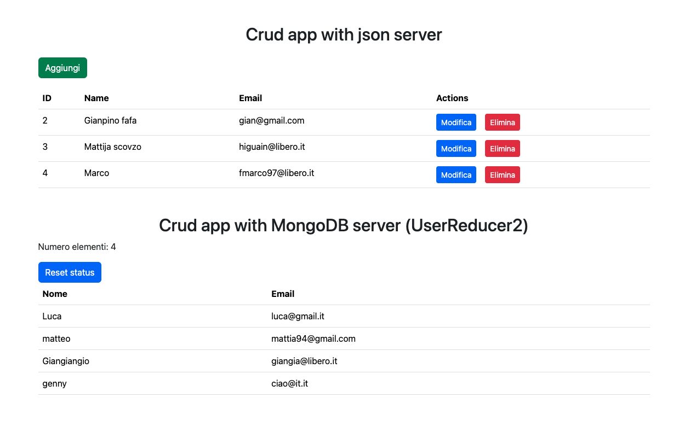
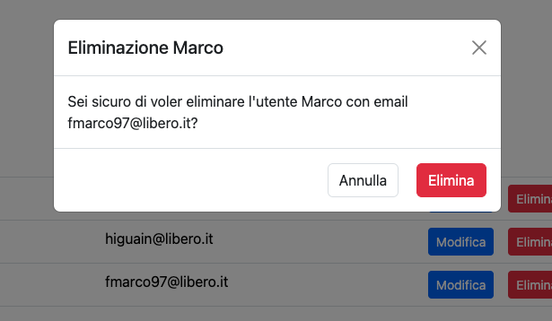

<!-- [![Contributors][contributors-shield]][contributors-url]
[![Stargazers][stars-shield]][stars-url]
[![Issues][issues-shield]][issues-url]
[![MIT License][license-shield]][license-url]
[![LinkedIn][linkedin-shield]][linkedin-url] -->

<!-- 
    https://img.shields.io/badge/npm-v10.5.0-blue?logo=npm
    Il badge che hai menzionato segue una struttura specifica definita da Shields.io per creare badge personalizzati con testo, colore e logo. Ecco una spiegazione dettagliata della struttura utilizzata per creare badge come quello per React e Vite:
    https://img.shields.io/badge/<label>-<message>-<color>?logo=<logo>
    Componenti del Badge:
Base URL:

https://img.shields.io/badge/
Label:

È il testo a sinistra del badge. Nel tuo esempio, react è il label.
Message:

È il testo a destra del badge. Nel tuo esempio, vite è il message.
Color:

È il colore di sfondo del badge. Nel tuo esempio, blue è il colore scelto.
Logo:

È il logo che appare a sinistra del badge. Nel tuo esempio, react è il logo che rappresenta React. Il parametro logo= è opzionale e può essere omesso se non si desidera un logo.
Esempio Spiegato:
Il tuo badge specifico per React e Vite ha la seguente struttura:

plaintext
Copia codice
https://img.shields.io/badge/react-vite-blue?logo=react
Label: react
Message: vite
Color: blue
Logo: react
Questo URL genera un badge con il testo "react" a sinistra, "vite" a destra, un colore di sfondo blu e il logo di React.
 -->
[](#contributors--contr)
[](https://www.npmjs.com/)
[](https://nodejs.org/en)
[](https://www.npmjs.com/package/mongoose)
[](https://www.npmjs.com/package/nodemon)
[](https://www.paypal.com/paypalme/foferys)

## About The Project


This web application is a basic exercise using React and React Router. The entire codebase is thoroughly commented to aid understanding and learning. The project demonstrates the use of two types of "servers":

1. A server created from a JSON file containing the data.
2. A local server with MongoDB connected to the React app.

In this application, you can add, modify, and delete users in the table, providing a hands-on experience with CRUD operations.
##### Delete, add or edit users


<p align="right">(<a href="#readme-top">back to top</a>)</p>


### Built With

This section should list any major frameworks/libraries used to bootstrap your project.

[](https://reactjs.org/)
[](https://reactrouter.com/en/main)
[](https://vitejs.dev/)
[](https://getbootstrap.com)
[](https://www.npmjs.com/package/axios)
[](https://www.npmjs.com/package/framer-motion)
[](https://www.npmjs.com/package/express)


<p align="right">(<a href="#readme-top">back to top</a>)</p>


#### Developing
To begin developing, do this:

```bash
$ git@github.com:foferys/react-crud-mongodb.git
```

### Install & Start:
_👀 client and server installation & start_
```bash
# Navigate to the client directory and install dependencies
$ cd client
$ npm install
$ npm run dev

# Navigate back to the root directory
$ cd ..

# Navigate to the server directory and install dependencies
$ cd server
$ npm install
$ npm start
```

## Contributors ✨ [](#about-the-project)

<!-- Thanks goes to these wonderful people -->

<!-- prettier-ignore-start -->
<!-- markdownlint-disable -->
<table>
  <tbody>
    <tr>
      <td align="center" valign="top" width="14.28%"><a href="http://ivesvh.com"><br /><sub><b>Gianpiero Ferraro</b>(always me lol)</sub></a><br />
      </td>
    </tr>
</tbody>
</table>


**Start coding!** 🎉


